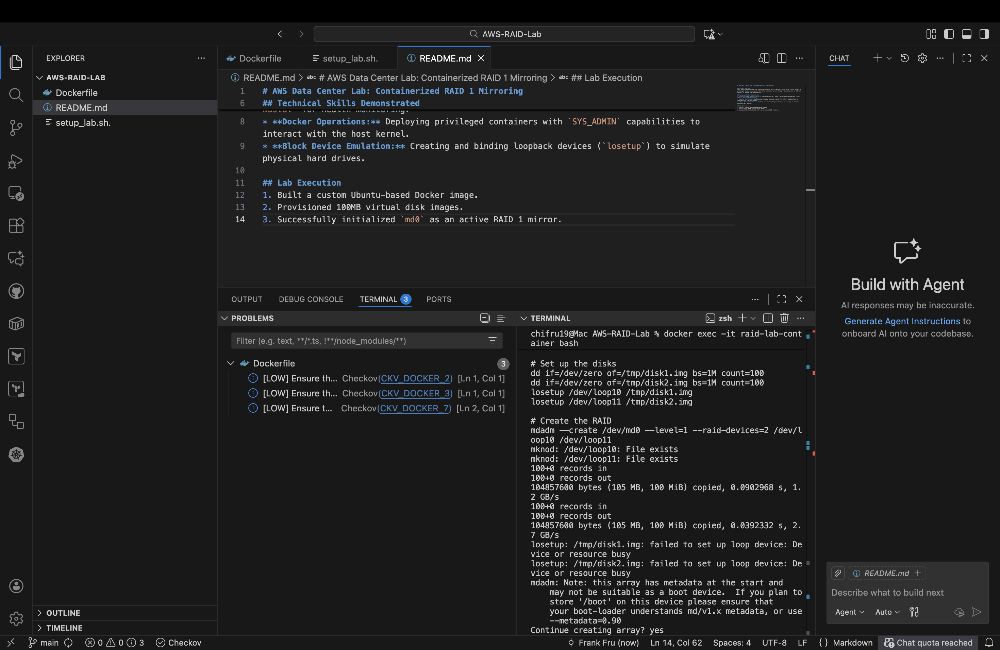

# AWS Data Center Lab: Containerized RAID 1 Mirroring

## Project Overview
This project demonstrates the configuration of a RAID 1 (Mirror) array using `mdadm` within a privileged Docker environment. This setup simulates server storage redundancy used in AWS Data Centers to ensure high availability.

## Technical Skills Demonstrated
* **Linux Storage Administration:** Proficient use of `mdadm` for array creation and `/proc/mdstat` for health monitoring.
* **Docker Operations:** Deploying privileged containers with `SYS_ADMIN` capabilities to interact with the host kernel.
* **Block Device Emulation:** Creating and binding loopback devices (`losetup`) to simulate physical hard drives.

## Lab Execution
1. Built a custom Ubuntu-based Docker image.
2. Provisioned 100MB virtual disk images.
3. Successfully initialized `md0` as an active RAID 1 mirror.

